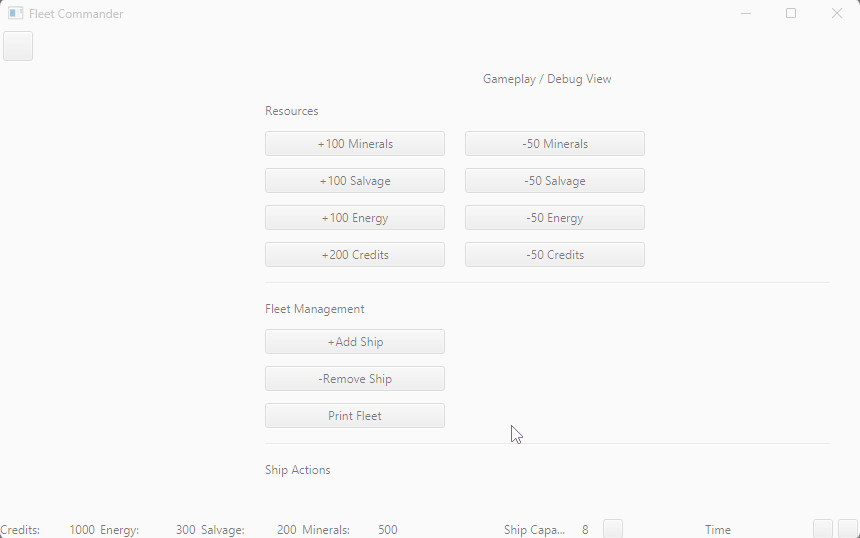
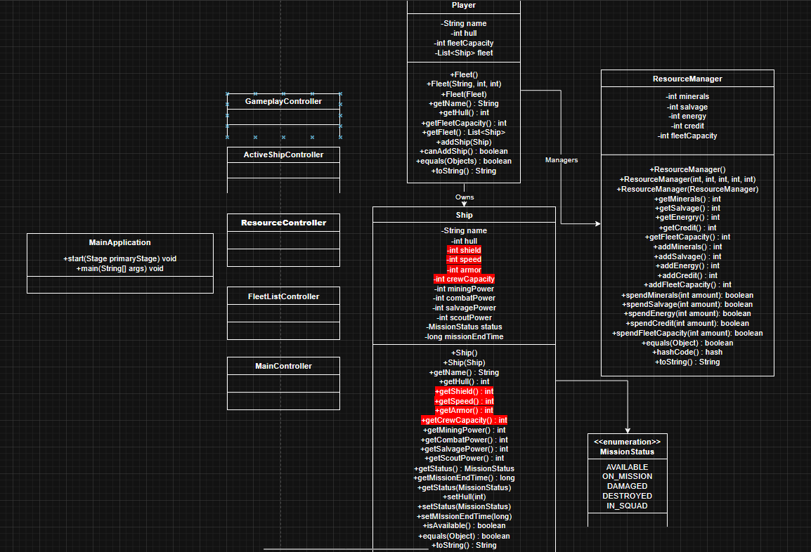
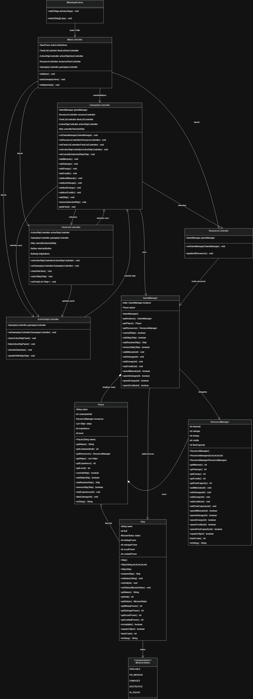
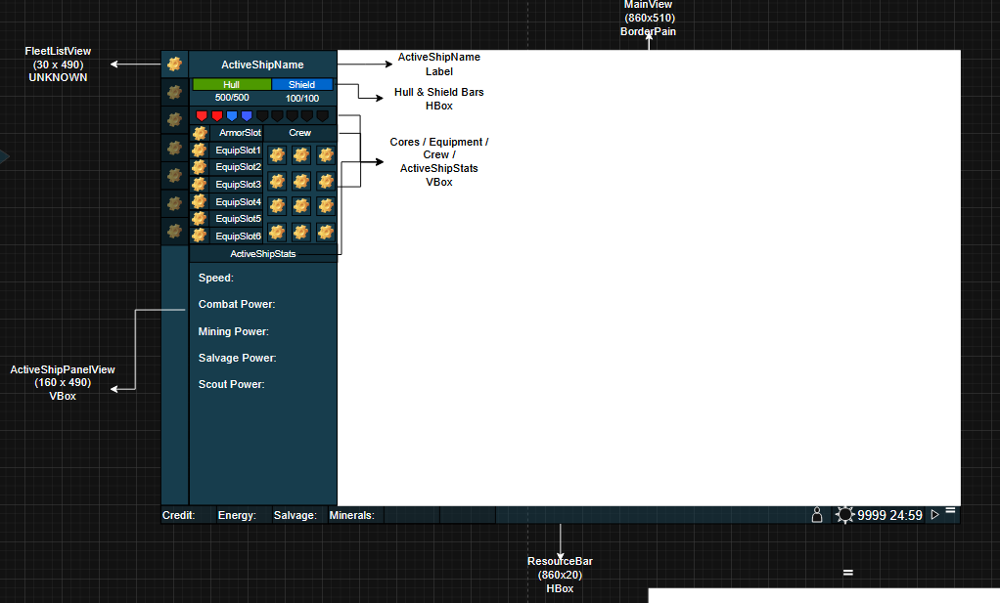
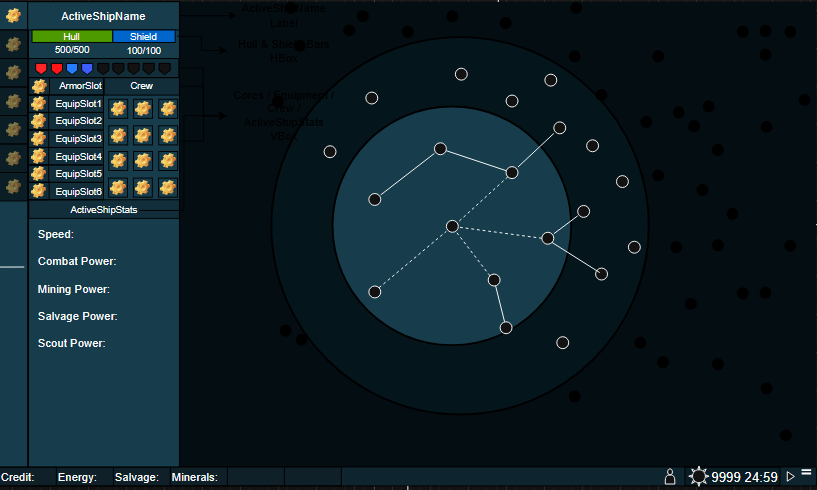
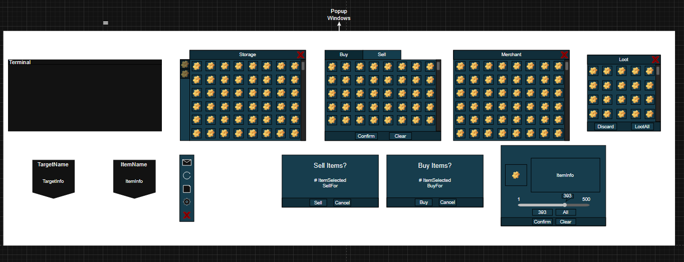

# Unit Deliverable 3 - Final Project

Fleet Commander is a test of concept for a turn based space exploration game! I was inspired by Slay the Spire 2, mixed with 
Stellaris. In this project we have established being able to create ships, assign stats to the ships, and have a character sheet, 
and be able to manage the fleet, and it's resources. There are a lot of buttons I wasn't able to get to, such as the storage,
tooltips, equipment, menu, or functioning time. However I'm pretty happy with were I did get to because it's a good start to the
main mechanics of the game.

## Demo

## UML Diagram

### Old UML
Here is my original UML diagram that was what I ended with in UD2

### New UML
Vs this is the new UML that I have now, showing the connections between the different controllers, and managers.

## Wireframe

This is the original wireframe that I had, far prettier than the final version but it got me here!

This is the really basic idea for map traversal that is the future goal.

And lastly these are popup windows I wasn't able to get to that need to be considered before moving on to main gameplay.

